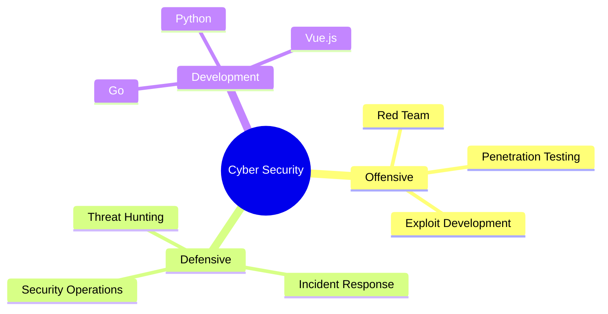

<div align="center">

<!-- 标题动画 -->
[](https://git.io/typing-svg)

<!-- 赛博朋克分割线 -->


<!-- 3D贡献图 -->


<!-- 黑客动画 -->


<!-- 技能徽章 -->
<div align="center">
  
  
  
</div>

</div>

<!-- 矩阵代码效果部分 -->
```diff
@@                    SYSTEM INFORMATION                    @@
+ Status: Active
- Location: Classified
! Mission: Protecting Digital Assets
# Specialization: Advanced Cyber Security Operations
```

<!-- 技能矩阵 -->
<h2 align="center">⚡ SKILL MATRIX ⚡</h2>



<!-- 认证展示 -->
<h2 align="center">🏆 CERTIFICATIONS 🏆</h2>

<div align="center">

| CERTIFICATION | LEVEL | STATUS |
|:------------:|:------:|:------:|
|  | `EXPERT` | ✅ |
|  | `MASTER` | ✅ |
|  | `EXPERT` | ✅ |
|  | `ADVANCED` | ✅ |
|  | `EXPERT` | ✅ |

</div>

<!-- 技术能力展示 -->
<h2 align="center">💻 TECH ARSENAL 💻</h2>

<div align="center">
<table>
<tr>
<td width="50%">

```python
class CyberNinja:
    def __init__(self):
        self.codename = "Shadow Guardian"
        self.status = "Mission Ready"
        self.threat_level = "Maximum"
        
    async def hack_the_planet():
        return "Access Granted"
```

</td>
<td width="50%">

```ascii
┌──────────────────────────┐
│   OPERATIONAL STATUS     │
├──────────────────────────┤
│ [█████████████] 100%     │
│ Systems: ONLINE          │
│ Security: MAXIMUM        │
│ Threat Level: CRITICAL   │
└──────────────────────────┘
```

</td>
</tr>
</table>
</div>

<!-- 技能进度条 -->
<h2 align="center">🔥 POWER LEVELS 🔥</h2>

```css
╔══════════════════════════════════════════════════════════╗
║ Penetration Testing  ███████████████████████████░░ 95%   ║
║ Red Team Operations  ████████████████████████████░ 98%   ║
║ Security Dev         ███████████████████████░░░░░░ 85%   ║
║ Incident Response    ██████████████████████████░░░ 90%   ║
╚══════════════════════════════════════════════════════════╝
```

<!-- GitHub统计 -->
<div align="center">
  
</div>

<!-- 活动统计 -->
<h2 align="center">📊 OPERATIONAL METRICS 📊</h2>

<div align="center">
  
  
</div>

<!-- 联系方式 -->
<h2 align="center">📡 SECURE CHANNELS 📡</h2>

<div align="center">
  <a href="free04k@gmail.com">
    
  </a>
  <a href="[https://github.com/your-username](https://github.com/MochizukiSec)">
    
  </a>
</div>

<!-- 底部动画 -->
<div align="center">
  
</div>

<!-- 访问计数器 -->
<div align="center">
  
</div>

<!-- 赛博朋克结束线 -->

